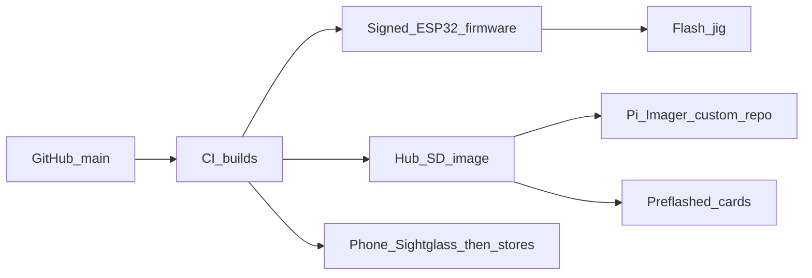

# Sightglass / Helm: build, ship, customer setup, and pricing

Street prices as of 2026. Treat as planning numbers, not a quote. Competitor ceiling: AvidAqua InSight **$159.95**, InSight Pro **$199.95**.

The rule that keeps this sellable: **customers never see Linux, never open a terminal, never flash with PlatformIO.** You (or a factory) do that. They plug in USB-C and use the phone app.

---

## What you sell

| SKU | What it is | Who it's for |
|---|---|---|
| **Sightglass** | 4" ESP32 glance display, cased, pre-flashed | Everyone. This is the product. |
| **Sightglass Pro** | Same + room CO₂ / RH / temp / VOC | pH-chasers. Same story as InSight Pro. |
| **Helm** | Headless Pi in a case, pre-flashed SD (or Imager image) | History, remote alerts, extra tanks, extra glass. Optional. |
| **DIY Kit** | Flashed module + printed parts + cable, you assemble | Hobbyists. Lower price, you skip case finishing. |

Do not sell “a Raspberry Pi with instructions.” Sell Helm. The Pi is an ingredient.

Sightglass works alone with Apex. Helm is an upsell, not a requirement. That matches how InSight sells.

---

## How software is built (you, not the customer)

1. **Sightglass app** — this website first. Later TestFlight / Play. Setup, layouts, Apex login, Helm pairing, glass adopt.
2. **Sightglass firmware** — ESP-IDF + LVGL. CI builds a `.bin`. Factory jig or `esptool` on a fixture flashes it. OTA from Helm or from the app afterward. Customers never compile.
3. **Helm image** — GitHub Action runs `pi-gen` / `sdm` on Raspberry Pi OS Lite: Docker, Helm compose, first-boot BLE + SoftAP, no desktop, SSH off by default. You publish it as a **Raspberry Pi Imager custom OS** (one dropdown: “Helm”). Customers who buy a blank card still never touch Linux — Imager writes the card like a camera SD.
4. **Accounts** — local on Helm (email + password stored on the box). Cloud login is later and optional. Offline must work.

Linux exists only in your pipeline. If a card dies, they re-flash with Imager or buy a replacement SD from you.

---

## How hardware is built

### Phase A — garage (1–20 units, now)

- Buy Guition / Waveshare **ESP32-S3 4" 480×480** modules (~$20–28).
- 3D-print stand, bezel, mag plate (PETG/ASA).
- Flash firmware on a USB fixture (one script).
- Hub: Pi 5 **1GB ($45)** or 2GB ($55), endurance microSD, official USB-C PSU, printed case. Flash the image once.
- Bag + box + one-page card. You ship USPS.

This is enough to sell to friends and a local reef club. Do not design a PCB yet.

### Phase B — small batch (20–100)

- Same modules, better print (or Shapeways / local MJF for cases).
- Simple flash jig: pogo USB + a “pass” LED.
- Printed inserts, MAP sticker, serial QR.
- Hub still a Pi in a nicer shell (injected later).

### Phase C — real product (100+)

- Custom PCB (JLCPCB): ESP32-S3, USB-C, speaker amp, I2C for SCD40 + SGP41, light pipes.
- Display as a bought IPS+capacitive stack, not a hobby module.
- Vacuum-formed or injected case.
- Contract assembler does SMT + flash + test.
- 3PL (Amazon/ShipStation) ships.

Custom PCB is how you protect margin and look finished. It is not how you start.

---

## How it gets to a customer

**Direct (first):** your site. $8–12 USPS Priority in a small box. You eat PayPal/Stripe ~3%.

**Dealers later (BRS, local shops):** they need ~35–45% gross. Price MAP so a shop can sell at the same number as your site. High-end reef gear does this. If you cannot give a shop ~40% and still profit, do not go wholesale yet.

**What’s in the box**

- Sightglass: display, USB-C cable 1.5 m, stand, panel-mount strap. PSU **not** included (same as InSight; saves SKU and shipping weight).
- Sightglass Pro: same + sensors already inside.
- Helm: box, pre-flashed SD seated, USB-C PSU (required — Pi is picky), 1-page setup.

Replacement SD and extra stands as $9–19 accessories.

---

## How a customer sets it up (zero Linux)

Same procedure for Helm and Sightglass. If a step needs a computer that is not “Imager → Write,” it is wrong.

### Sightglass only (most people)

1. Plug USB-C into a 5W+ brick.
2. Screen shows a pairing code (first boot SoftAP + BLE).
3. Phone app: Add screen → finds it over Bluetooth (stay on home Wi-Fi) or join `Sightglass-XXXX` if BLE is blocked.
4. Pick house Wi-Fi. Sightglass joins LAN, talks to Apex Local (they type Apex IP once, or the app discovers it).
5. Layout widgets in the app. Done.

No Helm required. Unplug Helm tomorrow, the glass still shows pH.

### Helm (optional black box)

1. Either it arrived pre-flashed, or they open **Raspberry Pi Imager**, pick Helm, write the SD, insert, close the case. That is the entire “computer” step — same as flashing a camera card.
2. Plug USB-C. White LED breathes. Bluetooth on. Fallback Wi-Fi `Helm-7F2A`.
3. App: Set up Helm → Pair (BLE recommended) → house Wi-Fi → create Helm account (not a Linux user).
4. Adopt screens (same pairing codes).
5. History, remote alerts, extra tanks live here.

If the SD corrupts in two years: Imager again, or $19 replacement card from you. Still no SSH.

### Dummy (what the app should let you walk today)

- `/hub` — fake flash → plug in → BLE/AP → Wi-Fi → account → adopt.
- `/panel` — fake 4" firmware: pairing code, then glance after adopt.

Use that to finish copy and timing before you buy a reel of boards.

---

## Bill of materials (your cost)

### Panel (finished, qty ~20, off-the-shelf module)

| Item | Unit |
|---|---|
| ESP32-S3 4" 480×480 module | $22 |
| Printed case + stand + mag plate | $6 |
| USB-C cable 1.5 m | $4 |
| Speaker / buzzer | $2 |
| Box, insert, serial sticker | $4 |
| Labor flash + test + pack (15 min) | $10 |
| **COGS** | **~$48** |

Wall PSU not included (~$6 if you add a kit SKU).

### Panel Pro adders (qty ~20)

| Item | Unit |
|---|---|
| Sensirion SCD40 (bare, not Adafruit breakout) | $12–14 |
| SGP41 VOC | $7 |
| Extra labor / cal | $4 |
| **COGS Pro** | **~$71** |

Do not use Adafruit/SparkFun breakouts in a sold unit ($45–80). Buy Sensirion reels.

At **qty 100+ custom PCB**: Panel COGS can fall toward **$32–40** (board + glass + case), Pro **$50–58**.

### Hub (qty ~20)

| Item | Unit |
|---|---|
| Raspberry Pi 5 1GB | $45 |
| 32 GB high-endurance microSD | $14 |
| Official 27W USB-C PSU | $12 |
| Printed / bought case | $8 |
| USB-C cable | $3 |
| Box + insert | $4 |
| Labor image + boot test | $12 |
| **COGS** | **~$98** |

Pi 5 2GB ($55) if 1GB feels tight in soak tests. Do **not** ship Pi Zero 2 W ($15) as the Hub — 512 MB + Docker + history will make you support-miserable. SD wear is the Hub’s real reliability tax; endurance cards and later a USB SSD kit ($25 extra, sell as Hub Pro storage).

At qty 100, Hub COGS still ~$90 because the Pi does not get cheaper like a custom PCB does. That is why Hub is an accessory, not the hero SKU.

### Your other costs (not in COGS)

- Stripe ~3%
- USPS small box $7–12 domestic
- Warranty reserve ~2% of revenue
- App store cut if you leave the PWA (15–30%) — stay PWA as long as you can

---

## What you can sell it for

Anchor to InSight. Reef buyers already pay this. Undercut a little, or match and win on Hub + open + extra Apex gear.

| SKU | Suggested MAP / DTC | Dealer pay (40% off) | Your gross DTC | Your gross via shop |
|---|---|---|---|---|
| Sightglass | **$149** | $89 | ~$101 (68%) | ~$41 (46% on $48 COGS) |
| Sightglass Pro | **$199** | $119 | ~$128 (64%) | ~$48 |
| Helm | **$149** | $89 | ~$51 (34%) | **~$\u22129 — don’t wholesale Helm at 40% until COGS drops** |
| Sightglass + Helm bundle | **$269** | — | ~$123 | DTC only at first |
| DIY panel kit | **$79** | — | ~$31 | DTC / club only |
| Extra stand / mag | **$19** | $11 | high | fine |
| Replacement SD | **$19** | $11 | high | fine |

**Read the Helm row:** a Pi inside a $149 box is a weak wholesale item. Sell Helm **direct only** until you have a cheaper compute module or you raise Helm to **$179–199** (then dealer $107–119, you keep ~$10–20 — still thin).

**Best money:** Sightglass at $149. Attach Pro for $50 more (sensors cost you ~$23). Helm is the “I have two tanks / I want graphs” upsell at $149 DTC.

**Do not** add a subscription for core glance/feed. InSight’s “pay once” is part of why it sells. Optional paid cloud remote later.

---

## What to build in what order (money, not vibes)

1. **App + dummy Helm/Sightglass setup in this repo** — walk the unboxing in software.
2. **Live Apex soak** on your tank (read-only, then feed).
3. **10 garage Sightglass units** — sell or gift to club people. Learn returns.
4. **Helm image + 5 Helm boxes** — only after glass doesn’t need you on Discord.
5. **Sightglass Pro sensors** once CO₂ vs pH is a story you believe.
6. **Custom PCB** when you are tired of hobby modules and have 50+ in the wild.
7. **Dealer kit** only when Sightglass COGS < $45 and you can give 40% without crying.

If cash is tight: skip Helm SKU for six months. The glass is InSight. Helm is a nice extra that a Pi tax makes hard to wholesale.
